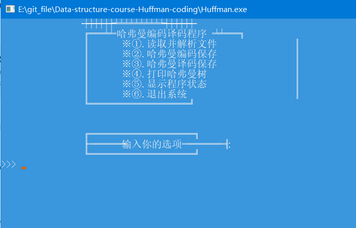
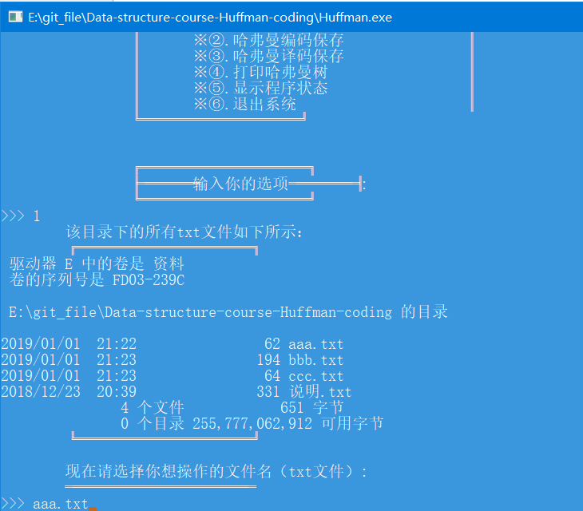
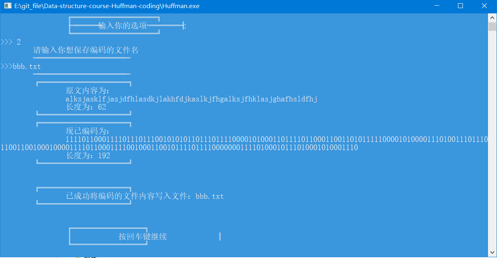
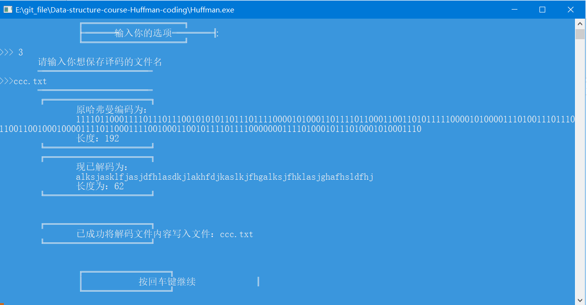
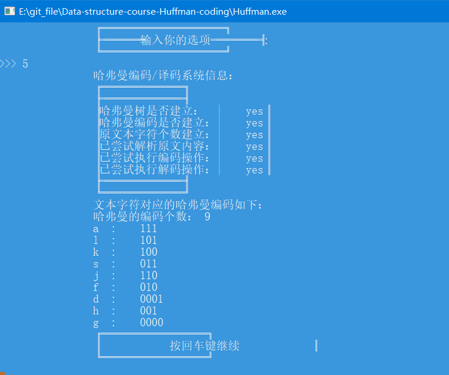
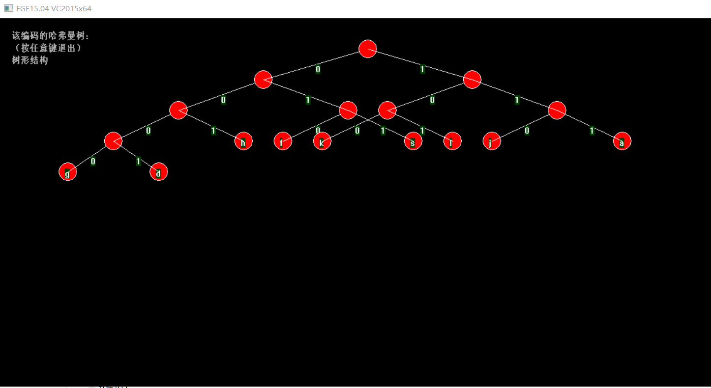

# Data-structure-course-Huffman-coding
The data structure assignment (Huffman Coding).
大二上数据结构课设结课作业（哈弗曼编码），开源仅供参考。

#### 操作演示

* ①读取当前目录下的txt文件初始化哈夫曼编码和哈夫曼树
* ②读取原始文件进行哈夫曼编码，并保存在你输入的文件里
* ③读取哈夫曼编码文件进行解码，并保存在你输入的文件里
* ④形象地输出哈夫曼树
* ⑤显示哈夫曼编码程序的运行状态
* ⑥退出程序

---

#### 效果图

* 主界面

* 读入文件

* 编码

* 译码

* 查看状态

* 输出哈弗曼树的图

----

### 以上就是大二上期的结课项目，很丑陋，也很不成熟，希望能勉励自己进步！

